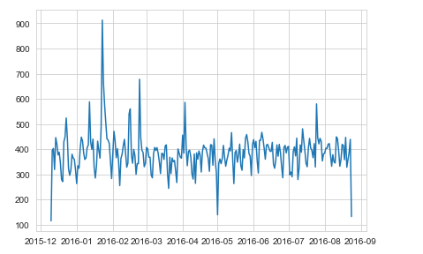

# 911calls_data_capstone_project
Data Science Project on analyzing 911 calls data from kaggle.

## [Project 1 Code](https://github.com/TatyaVichu/911calls_data_capstone_project/blob/main/01-911%20Calls%20Data%20Capstone%20Project.ipynb)

### Overview :  

For this capstone project we will be analyzing some 911 call data from [Kaggle](https://www.kaggle.com/). The data contains the following fields:

<ul>
<li>lat : String variable, Latitude</li>
<li>lng: String variable, Longitude</li>
<li>desc: String variable, Description of the Emergency Call</li>
<li>zip: String variable, Zipcode</li>
<li>title: String variable, Title</li>
<li>timeStamp: String variable, YYYY-MM-DD HH:MM:SS</li>
<li>twp: String variable, Township</li>
<li>addr: String variable, Address</li>
<li>e: String variable, Dummy variable (always 1)</li>
</ul>

### Dataframe Used : 

#### Basic Questions :

##### Top Five Zip Codes Used : 

##### Top 5 Townships : 

#### Creating New Features :

In the titles column there are "Reasons/Departments" specified before the title code. These are EMS, Fire, and Traffic. Create a new column called "Reason" that contains this string value.

*For example, if the title column value is EMS: BACK PAINS/INJURY , the Reason column value would be EMS. *

<b>New DataFrame(with reason column):</b>

##### The most common REASONS for this 911 calls : 

##### The CountPlot of 911 calls by Reason :

##### Seperating hour,day of week and month from the timestamp column and creating the new column for each.

##### Create a countplot of the Day of Week column with the hue based off of the Reason column : 

##### Create a countplot of the Month column with the hue based off of the Reason column.

##### Now as some months are missing ,filling in this information by plotting the information in another way, possibly a simple line plot that fills in the missing months, in order to do this, group the dataframe with respect to months

##### Create a simple plot off of the dataframe indicating the count of calls per month : 

##### Create a linear fit on the number of calls per month : 

##### Create a new column called 'Date' that contains the date from the timeStamp column :

##### Groupby this Date column with the count() aggregate and create a plot of counts of 911 calls : 

##### Recreate the above plot but create 3 separate plots with each plot representing a Reason for the 911 call :

##### Reconstructing the dataframe to make hours as column and index to be day of week

##### Create the heatmap of the above dataframe

##### Create the clustermap of the same

##### Now a dataframe with Month as the column and index to be day of week

##### Create the heatmap of the above dataframe

##### Create the clustermap of the same

